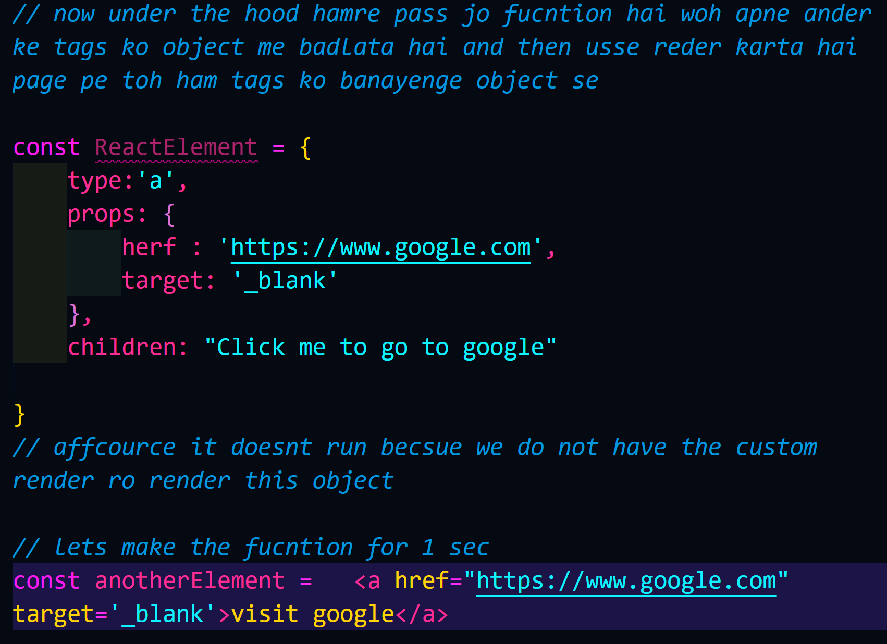

## we can make the fucntion inside the main.jsx and run the our funtion 
```javascript

// import { StrictMode } from 'react'
import { createRoot } from 'react-dom/client'

// import App from './App.jsx'

// eventually ham jo app ko laa rhae hai woh usme bhi toh ek fucntion hi hai then why not we can make our own fucntion here and try to use it and render it 

function MyApp(){
    return(
        <div>
            <h1>Hello bro !</h1>
        </div>
    )
}


createRoot(document.getElementById('root')).render(

    // <App />

    // lets use the MyApp
    <MyApp/>

      MyApp()
      // we can use just call the fucntion not the jsx syntax

)


```

// now under the hood hamre pass jo fucntion hai woh apne ander ke tags ko object me badlata hai and then usse reder karta hai page pe toh ham tags ko banayenge object se

```javascript 
const ReactElement = {
    type:'a',
    props: {
        herf : 'https://www.google.com',
        target: '_blank'
    },
    children: "Click me to go to google"

}
```

// problem while creating our own element and rndering because the render of dom expect some predefined syntax

