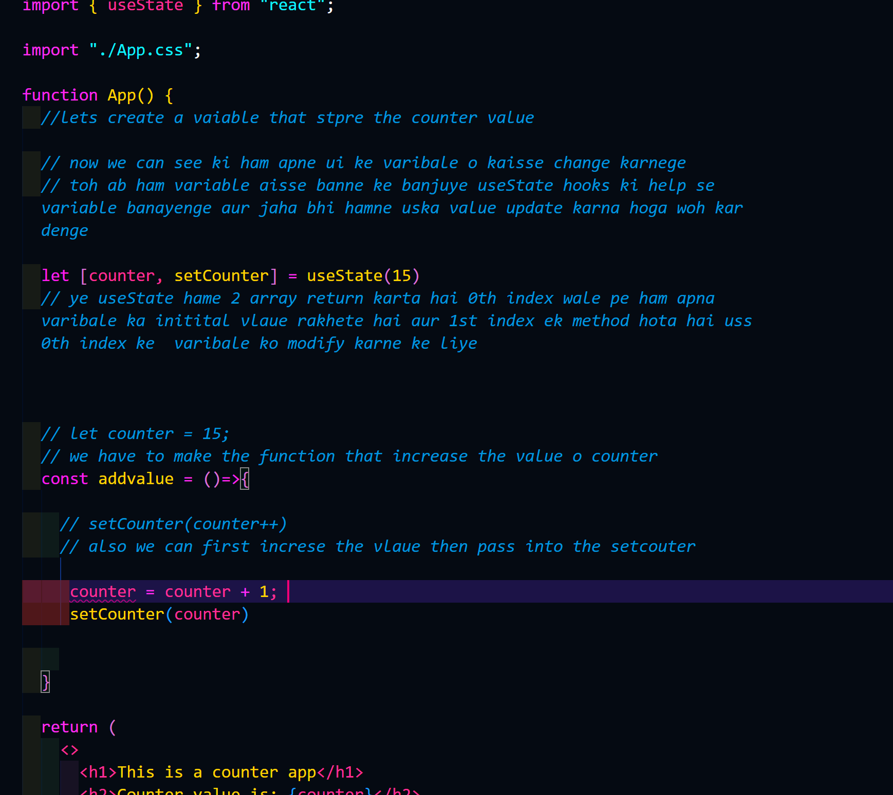

// ham purane js methode se react page me varibale change kanrene ka try kar rahe hai woh ho nahi raha hai kyuki hamra state change karna parega kyui react hamresa responsible hota hai ui updation ke liye 

```javascript
import { useState } from "react";

import "./App.css";

function App() {
  //lets create a vaiable that stpre the counter value

  // now we can see ki hamra 

  let counter = 15;
  // we have to make the function that increase the value o counter
  const addvalue = ()=>{
    counter++;
    console.log('hello',counter);
    
  }

  return (
    <>
      <h1>This is a counter app</h1>
      <h2>Counter value is: {counter}</h2>
      <button onClick={addvalue}>Increase{counter}</button>
      <br />
      <button >decrease</button>
    </>
  );
}

export default App;
```

## how we use the useState hook
