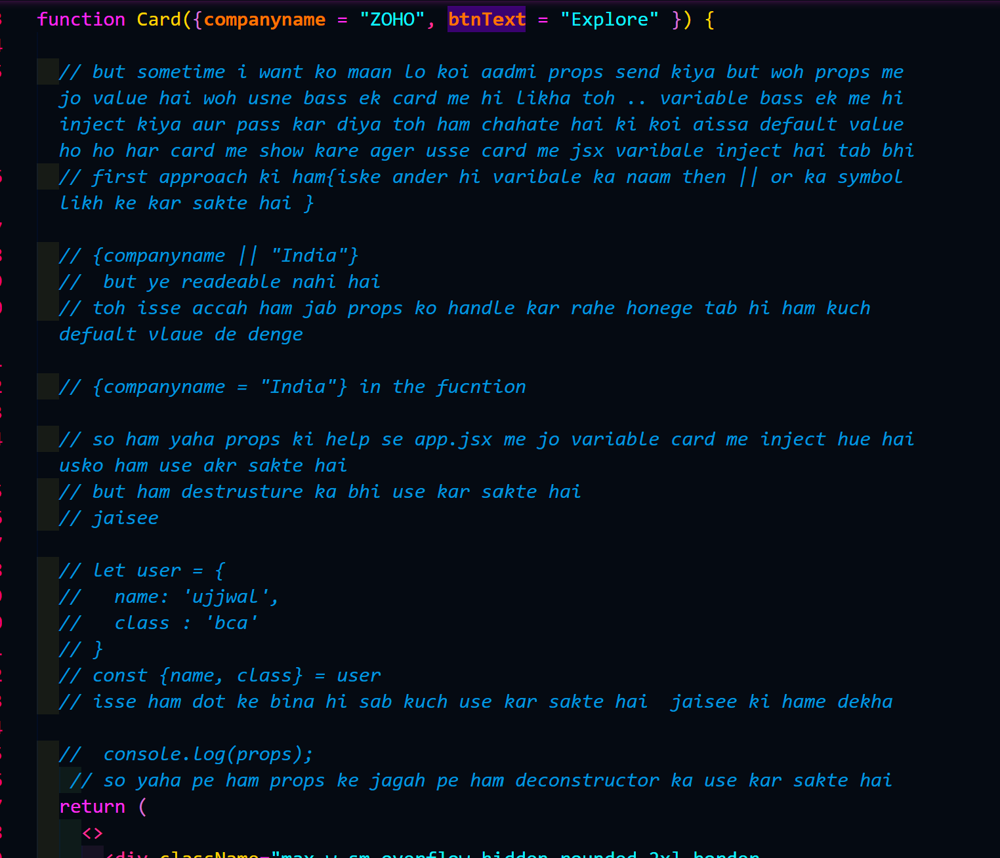
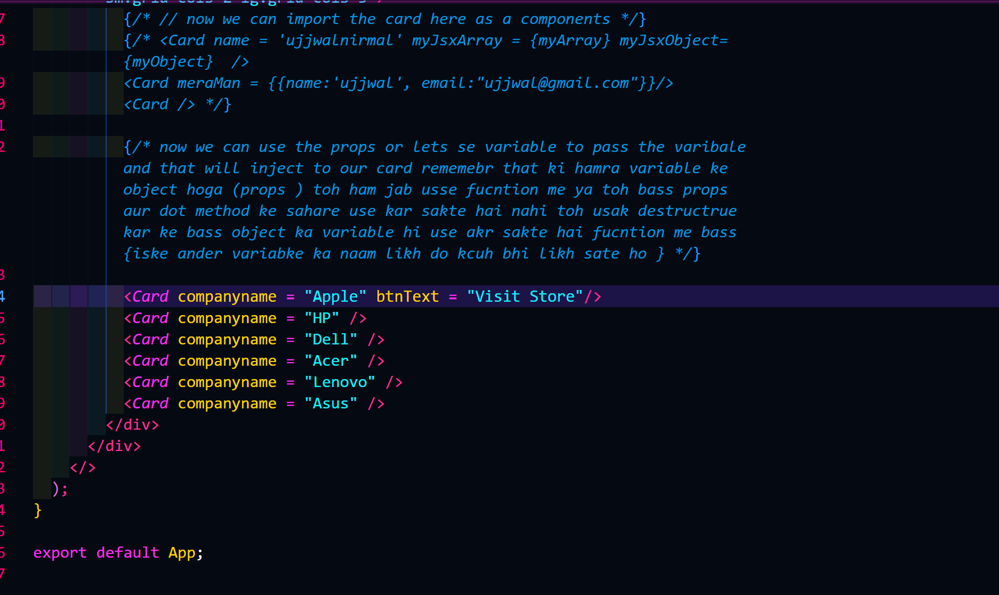

## so here we see ki kaisse ham componets banate hai

// samjse pahel ham ek folder banayenge componets naam ka
// then ham usme ek .jsx kaam ka file banayenge aur uske ander simple
`import React from 'react'`
// then ham wohi simple sa return function banayenge then apne fucntion ko export kar denge

```jsx
import React from "react";

function Card() {
  return (
    <>
      <div className="max-w-sm overflow-hidden rounded-2xl border border-gray-200 bg-white shadow-lg transition-all duration-300 hover:-translate-y-2 hover:shadow-2xl">
        

        <div className="p-6">
          <span className="rounded-full bg-blue-100 px-3 py-1 text-xs font-semibold text-blue-700">React</span>

          <h2 className="mt-4 text-2xl font-bold text-gray-800">Modern Card UI</h2>

          <p className="mt-2 text-gray-600">Build beautiful and responsive components using React and Tailwind CSS.</p>

          <button className="mt-6 w-full rounded-xl bg-blue-600 py-3 font-semibold text-white transition hover:bg-blue-700 active:scale-95">Explore</button>
        </div>
      </div>
    </>
  );
}

export default Card;
```

```jsx
// app.jsx

import { useState } from "react";
import reactLogo from "./assets/react.svg";
import viteLogo from "./assets/vite.svg";
import heroImg from "./assets/hero.png";
import "./App.css";
import Card from "./components/Card";

function App() {
  return (
    <>
      <div className="min-h-screen bg-gray-100 py-10">
        <h1 className="mb-10 text-center text-5xl font-bold text-red-500">Tailwind Working 🚀</h1>

        <div className="mx-auto grid max-w-7xl grid-cols-1 gap-8 px-6 sm:grid-cols-2 lg:grid-cols-3">
          {/* // now we can import the card here as a components */}
          <Card />
          <Card />
          <Card />

          <Card />
        </div>
      </div>
    </>
  );
}

export default App;
```

## we can make the variable and inject to the jsx elemet that can show on the css with the help of props

```jsx
import { useState } from "react";
import reactLogo from "./assets/react.svg";
import viteLogo from "./assets/vite.svg";
import heroImg from "./assets/hero.png";
import "./App.css";
import Card from "./components/Card";

function App() {
  // so ham jo value cards me banayenge vaariable banayenge woh jaa ke props me show hoga card.jsx me
  // like  hame banaye abhi myJsxArray woh jaa ke props ki help se card me show hoga

  // lets  make a variable that will inject the jsx element card
  // althouth we can put the variable and the decleleration on the jsx independently

  // <card name = 'ujjwal' />

  let myObject = {
    name: "ujjwal",
    email: "ujjwal@gmail.com",
  };

  // we can make our own array also and inject to the jsx element
  let myArray = [1, 2, 3, 4, 5, 6];
  // but we cannot directly place the object or array variable name to the jsx element we have to use the {} evaluated expresssion
  // and then we have to store that evaluated expression to a varibale

  return (
    <>
      <div className="min-h-screen bg-gray-100 py-10">
        <h1 className="mb-10 text-center text-5xl font-bold text-red-500">Tailwind Working 🚀</h1>

        <div className="mx-auto grid max-w-7xl grid-cols-1 gap-8 px-6 sm:grid-cols-2 lg:grid-cols-3">
          {/* // now we can import the card here as a components */}
          {/*
          <Card name = 'ujjwalnirmal' myJsxArray = {myArray} myJsxObject= {myObject}  />
          <Card meraMan = {{name:'ujjwal', email:"ujjwal@gmail.com"}}/>
          <Card />
          */}
          
          <Card />
          <Card />
          <Card />
          <Card />
          <Card />
          <Card />
        </div>
      </div>
    </>
  );
}

export default App;
```

// and hamne bass componts me jss ke fucntion me props likhna hai jiss bhi componets me hamne variable ko inject kiya hai yaad rahe jo variable hai ager woh object aur array store kar rha hai toh at the end woh evalluated expression / ham usse variable bol sakte hai kyuki ham last of the jsx me variable hi pass akrte hai ko hi leta hai


### variable injection through props and deconstructor 

```jsx
import React from "react";

function Card({companyname}) {
  // so ham yaha props ki help se app.jsx me jo variable card me inject hue hai usko ham use akr sakte hai 
  // but ham destrusture ka bhi use kar sakte hai 
  // jaisee 

  // let user = {
  //   name: 'ujjwal',
  //   class : 'bca'
  // }
  // const {name, class} = user
  // isse ham dot ke bina hi sab kuch use kar sakte hai  jaisee ki hame dekha 

   console.log(props);
   // so yaha pe ham props ke jagah pe ham deconstructor ka use kar sakte hai   
  return (
    <>
      <div className="max-w-sm overflow-hidden rounded-2xl border border-gray-200 bg-white shadow-lg transition-all duration-300 hover:-translate-y-2 hover:shadow-2xl">
        

        <div className="p-6">
          <span className="rounded-full bg-blue-100 px-3 py-1 text-xs font-semibold text-blue-700">React</span>

          <h2 className="mt-4 text-2xl font-bold text-gray-800">{companyname}</h2>
    {/* so just have to injec the varibale name in the place where we want to show the variable injection from the jsx element */}

          <p className="mt-2 text-gray-600">Build beautiful and responsive components using React and Tailwind CSS.</p>

          <button className="mt-6 w-full rounded-xl bg-blue-600 py-3 font-semibold text-white transition hover:bg-blue-700 active:scale-95">Explore</button>
        </div>
      </div>
    </>
  );
}

export default Card;
```
# app.jsx ka code 
``` jsx
import { useState } from "react";
import reactLogo from "./assets/react.svg";
import viteLogo from "./assets/vite.svg";
import heroImg from "./assets/hero.png";
import "./App.css";
import Card from "./components/Card";


function App() {
 
  // so ham jo value cards me banayenge vaariable banayenge woh jaa ke props me show hoga card.jsx me 
  // like  hame banaye abhi myJsxArray woh jaa ke props ki help se card me show hoga

  // lets  make a variable that will inject the jsx element card 
  // althouth we can put the variable and the decleleration on the jsx independently 

  // <card name = 'ujjwal' />

  let myObject = {
    name : 'ujjwal',
    email : 'ujjwal@gmail.com'
  };

  // we can make our own array also and inject to the jsx element
  let myArray = [1,2,3,4,5,6];
  // but we cannot directly place the object or array variable name to the jsx element we have to use the {} evaluated expresssion 
  // and then we have to store that evaluated expression to a varibale 


  return (
    <>
      <div className="min-h-screen bg-gray-100 py-10">
          <h1 className="mb-10 text-center text-5xl font-bold text-red-500">Tailwind Working 🚀</h1>

        <div className="mx-auto grid max-w-7xl grid-cols-1 gap-8 px-6 sm:grid-cols-2 lg:grid-cols-3">
          {/* // now we can import the card here as a components */}
          {/* <Card name = 'ujjwalnirmal' myJsxArray = {myArray} myJsxObject= {myObject}  />
          <Card meraMan = {{name:'ujjwal', email:"ujjwal@gmail.com"}}/>
          <Card /> */}

          {/* now we can use the props or lets se variable to pass the varibale and that will inject to our card rememebr that ki hamra variable ke object hoga (props ) toh ham jab usse fucntion me ya toh bass props  aur dot method ke sahare use kar sakte hai nahi toh usak destructrue kar ke bass object ka variable hi use akr sakte hai fucntion me bass {iske ander variabke ka naam likh do kcuh bhi likh sate ho } */}

          <Card companyname = "Apple" />
          <Card />
          <Card />
          <Card />
          <Card />
          <Card />
        </div>
      </div>
    </>
  );
}

export default App;
```
## handling the props 

