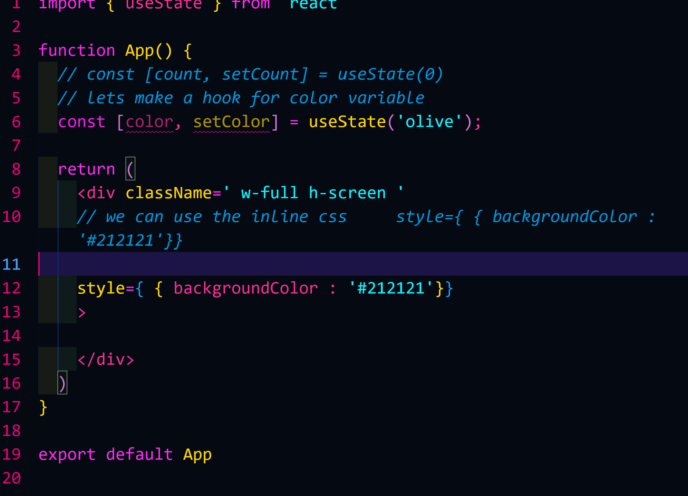

# we have to write the inline css in them `style = {{backgroundColor: "red"}}`

// aslo we can just write the varible in the style css aur ham 2 currly brackt diye hai uske ander hi direct likh sakte hai 