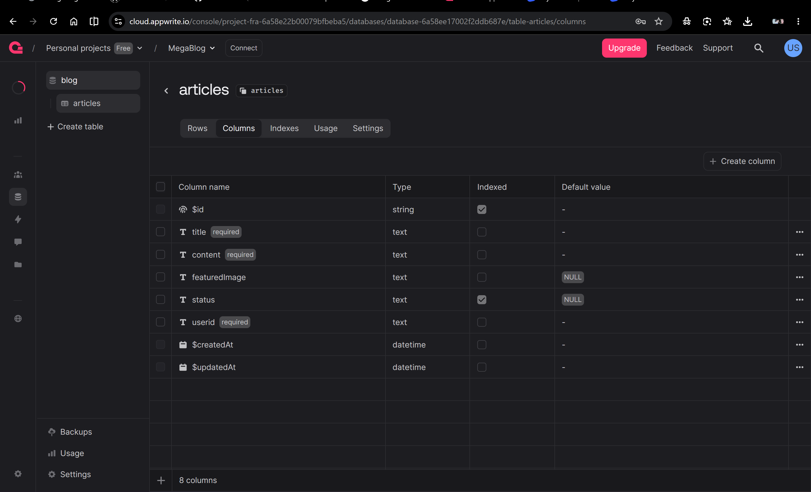

## so what we need to develop this project 
// for backend we use the
## appwrite 
// jo ki puri trah se open source hai /
// toh baad me ham sara project ko download kar ke deploy bhi kar sakte hai 

## tinymce
// we use tiny mce for giveing a text editor so we can customize our text

## react hook forms
// we use the reacthook forms for form related hook kyuki ye hame real time state change karne ka feature deta hai


# FLOW

##  create the project with vite
``` jsx
 npm create  vite@latest

> npx
> create-vite

│
◇  Project name:
│  12MegaBlog
│
◇  Package name:
│  12megablog
│
◇  Select a framework:
│  React
│
◇  Select a variant:
│  JavaScript
│
◇  Which linter to use?
│  ESLint
│
◇  Install with npm and start 
│  now?
│  Yes
│
◇  Scaffolding project in C:\Users\ujjwal kumar\Desktop\React\12MegaBlog...
│
◇  Installing dependencies with npm.

```

----
 ## then we install the redux toolkit for centralize single source on storage 

`npm install @reduxjs/toolkit
`
## and the react-redux libery

`npm install react-redux
`

---
## and we need react router dom

` npm install react-router-dom`

---

## then we need the appwrite .. kyuki ager install rahega toh calling akrna easy rehange

`npm install appwrite`

----

## then we install the tinymcv hamre visual code/text editor ke liye 

`npm install @tinymce/tinymce-react`

---

## then we install the html react parser becaue we are storing the text in html in our databse

` npm install html-react-parser `

--- 

## then we install the react hook form for live state changeing 

` npm install react-hook-form `


---
## now we make the evironment varibale file isme hamre sare secret chize hoti hai password and all

## isko banane ke liye hame hamesaha .env likhna parta hai aur usse .gitignore me daal dete hai taki ham ye file kisi ko na dikhaye 

# .env file hameasha hamre root folder me hota hai jaha pe readme.md file hoga like

## so we  are making the app with the help of vite so we have to use the storing of varibale like keys or databse password in some specfic way 

##  if we want to store some secret key then we have to write 

# VITE_SOME_SECRETE_KEY = 'jsvjksd'

# DB_PASSWORD = nsnvjsnlvn

## toh ager hame ye secret key aur password ko access karna hai toh uske liye bhi hamre pass kuch method hote hai 

# `import.meta.env.VITE_SOME_KEY` // iska answer hamre pass toh  aa jayega but 
# `import.meta.env.DB_PASSWORD ` // iska answer undefined hi print hoga 

---
# now the important chix ki ham databse banayenge usak id copy paset karne .env me then ham usme table create karenge aur uska is bhi paste karnege hamre .env me then ham jo table bana hua hai uske ander jaayenge aur 

## aur setting me jaa ke permissions ko eanbale karenge users ke liye

## in the articles table we make these coloumns banayenge 


## then we create a index

----
 # then we go the storeage section create bucket for our image

---
## now we make the a folder jaha pe ham apna sara secret chiz rakhenge kyuki kai baar .env file se woh load hi nahi karta hai 


----

## now we make the a folder jiska naam hoga servises jimse ham appwrite ki sari services hogi jaisse auth aur uske ander ham fir ek file banayenge jiska naam hoga auth.js jisme ham 
## conf file se conf fucntion ko layenge sabse pahle kyuki ham project is aur appwrite url chaiye hoga aur fir woh dene ke baad hamne jab bhi koi user create karna hoga toh 

## ham appwrite se client,accoutnt and id ko le aaynge aur fir client banayenge ek class jisme ham setendpoint and setproject me url and project id denge then ham uss client ki help se account banayenge jo ki ek class hi hoga 

## then we can make the user account.create , jisme hame id toh milega hi apprite se aur bass email aur password dalna rahega

----

## now we make the services for storange and jo ham datebase use kar rahe hai image dalne ke liye