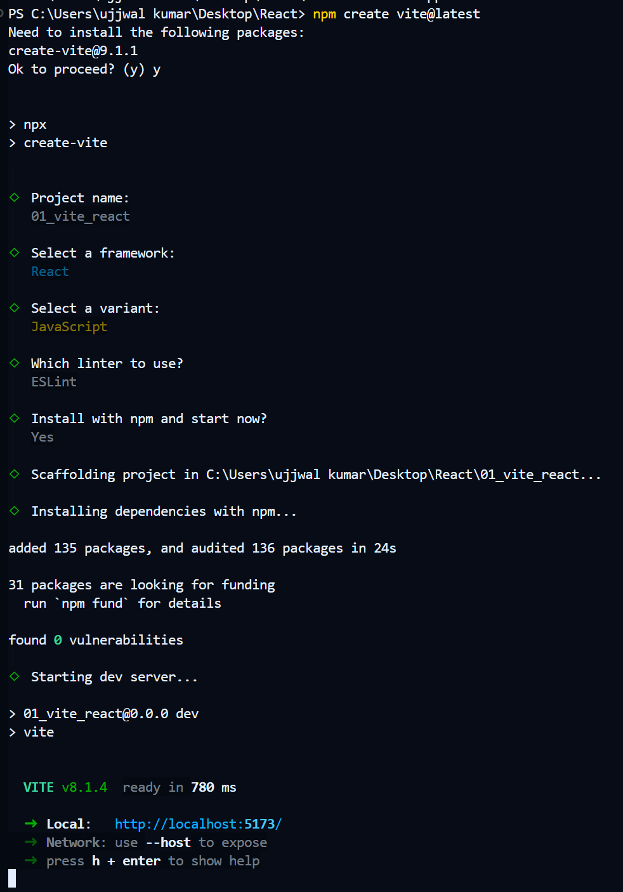

## installation

** we can make the project by the help of npm command but that was very lengthy and timeconsumming that why we use the vite = it is a bundler **

```md
# for npm installation we use the command npx = matlab ham bundule ko download nahi kanrege bass execute kar denge 

npx create-react-app o1-basic-react-app

then, 
cd o1-basic-react-app
npm run start


```

## but now we create the app using the vite 
```
// go to the terminal 
write

npm create vite@latest


```
==========================
## we cam make our own js file in the 01-vite-react but the major diffrence ki hame file ka naam .jsx rakhna parega aur function ka naam capital letter se suru karna parega 

// lets try to create the new jsx page in the vite react

** go to src folder and create a new file using the name of .jsx

** and after creating the .jsx we can make our own function and export that function == but rememeber that ki hamra fucntion ka naam capital letter se suru hona chaiye 

``` jsx
function Ujjwal(){
    return(
        <h1>This is Ujjwal</h1>
    )
}
export default Ujjwal
```

** now we go to the App.jsx and in the return we place our ujjwal fucntion and App.jsx me apne Ujjwal file ko import bhi kar lanege

```jsx


import Ujjwal from './ujjwal.jsx'
function App() {
 

  return (
    // <h1>hello react vite</h1>
    <Ujjwal/>
  )
}

export default App


```

// but we can not directly write multiple things in the return because the return only return 1 element ha uske ander bahut sare tag ho sakte hai like ek div ke ander hamne saro ko wrap kar diya 
#### but hamme baar baar div nahi likha hai toh ham bass ek empty tag return kar denge jisko ki ham fragment bolte hai (<> </>) 

```jsx

import Ujjwal from "./ujjwal.jsx";
function App() {
  return (
    <>
      <Ujjwal />
      <h4>hello react vite</h4>
      <h4>hello react vite</h4>
    </>
  );
}

export default App;


```

## so the main outcome from this is when we create a components 
components = koi function jo html tag return kar rahi 

---------
---

first outcome ki hamne apne fucntion ka naam capital letter melikhna hai aur usse export bhi karna hai

---
 then ham jab vite ya koi parsal ke help se react use kar rahe hai tho hame .jsx file banayna hai **signify that ki woh ek component hai**
  
  

  ## for adding the tailwindcss just go the your project folder useing cd 
  // then 
  //  npm install tailwindcss @tailwindcss/vite
  // then modify the vitfonfig file and add
  // @import "tailwindcss" to the css files